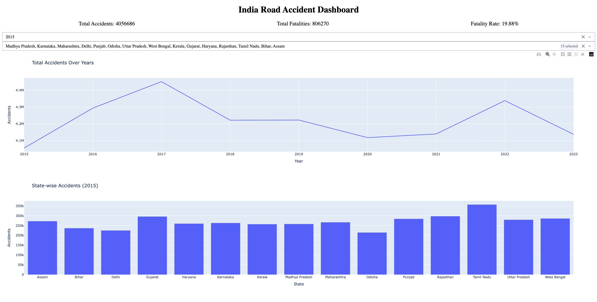
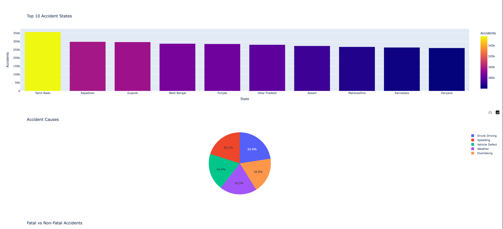
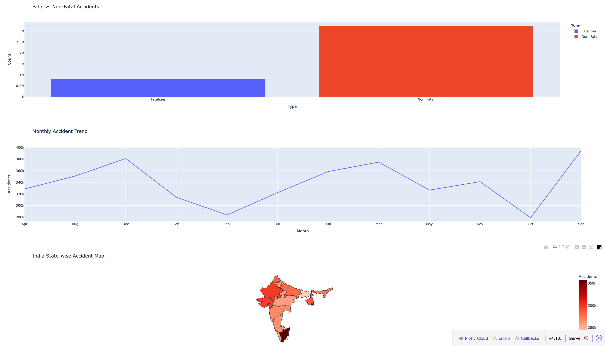

# 🇮🇳 India Road Accident Dashboard

## 📊 Overview
This project analyzes road accident trends across India using an interactive dashboard built with Dash and Plotly.

## 🚀 Features
- Year-wise accident trends
- State-wise comparison
- Top 10 accident-prone states
- Cause analysis (Speeding, Drunk Driving, etc.)
- Fatal vs Non-Fatal insights
- Monthly trend analysis
- Interactive filters (Year, State)

## 🛠 Tech Stack
- Python
- Pandas
- Plotly
- Dash

## 📷 Dashboard Preview

## ▶️ Run Locally
pip install -r requirements.txt  
python app.py
